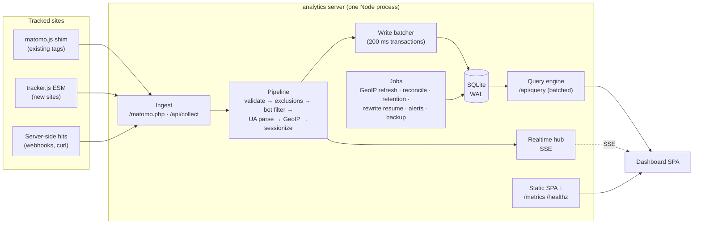

# 02 — Architecture

## Shape

One Node process, one SQLite file, one container. Ingestion, query, realtime,
background jobs, and static hosting of the dashboard SPA all live in the same
process. This is a deliberate rejection of the Matomo shape (PHP-FPM + DB
server + archiver cron), which is what made it slow and heavy on a small host.



## Component walkthrough

### Ingest endpoints

`GET|POST /matomo.php` (alias `/piwik.php`) for compatibility, plus a native
`POST /api/collect` JSON endpoint. Both normalize into the same internal `Hit`
type, respond immediately (204 or 1×1 GIF), and hand off to the pipeline.
Tracking endpoints are public by design: rate-limited per IP, strict payload
caps, unknown parameters ignored. Full parameter mapping in
[04-api.md](04-api.md).

### Enrichment pipeline (pure functions, in-process)

1. **Validate** — known site id, sane URL, clamp field lengths. The site
   comes from an in-memory copy (`pipeline/site-cache.ts`), not a table read
   per hit: the db helpers that write `sites` bump a generation it checks,
   and SQLite's `data_version` tells it when another process (the importer)
   committed. The site-local clock is computed once per hit and shared by the
   drop counters, the prop registry, the day salt and the sessionizer.
2. **Exclusions** — the client address against the configured rules (docs/03
   § Exclusions) → drop, increment a per-site counter. Literal addresses and
   CIDR prefixes match directly; hostname rules match an address set a timer
   keeps resolved, so nothing here does DNS work per hit.
3. **Bot filter** — `isbot(ua)` → drop, increment a per-site counter
   (visible in a diagnostics view; bots are counted, never stored).
4. **UA parse** — browser, browser version, OS, device type. Cached by UA
   string (LRU) since the same UA repeats constantly.
5. **GeoIP** — country/region/city + city centroid lat/lon from the local
   `.mmdb`, read via a pure-JS mmdb reader. The raw IP is used here and then
   discarded — it never touches disk.
6. **Sessionize** — daily-rotating visitor hash → find-or-create session
   (30 min idle timeout), update engagement. Details in
   [03-data-model.md](03-data-model.md).

### Write batcher

Enriched events append to an in-memory queue; a 200 ms timer flushes the queue
in a single SQLite transaction (events insert + sessions upsert). SQLite with
WAL does this in microseconds at our volumes. Graceful shutdown (`main.ts`)
flushes the queue first, before giving in-flight queries a bounded 3 s to
finish, then flushes again for hits that were mid-request; it exits non-zero
if anything queued could not be written. The accepted trade: a hard crash
loses at most ~200 ms of hits.

Single-writer discipline: all writes go through the batcher; reads happen
anywhere (WAL readers don't block the writer).

The same flush transaction maintains the rollup tables (docs/03 § Rollups):
hour-grain traffic, day-grain single-dimension marginals, day-grain session
metrics, and the exact-distinct presence helpers — so within any committed
snapshot the rollups can never lag the raw rows they summarize. The nightly
reconcile job re-derives yesterday from raw and treats any drift as a bug.

### Query engine

`POST /api/query` takes an array of widget queries (metric + dimension +
range + filters) and answers all of them inside one read transaction. Queries
compile from a whitelisted vocabulary to parameterized SQL — the client can
never send SQL. Responses carry an ETag derived from (site id, max event
rowid, schema version), so an unchanged dashboard revalidates with a 304 and
zero query work. This endpoint is the entire answer to Matomo's
36-XHR problem. Spec in [04-api.md](04-api.md).

Execution leaves the event loop: a worker-thread read pool (`query/pool/`,
N = min(4, parallelism − 1), each worker on its own read-only WAL connection)
compiles and runs the whole batch inside one read snapshot, so one
`dataVersion` describes every answer and a slow analytical query never stalls
ingest or its 200 ms flush. The main thread keeps parse/validation, window
resolution, segment expansion, rate limiting and the ETag pre-check. A planner
routes eligible metric shapes to the rollup tables and everything else
(raw-only dimensions, joint filters, cross-day distincts, session-scoped
filters, the sequence kinds) to raw — with an honest per-query refusal below
the retention horizon rather than partial numbers.

### Realtime hub

An in-memory ring buffer of recent enriched events feeds `GET /api/realtime`
(SSE). New connections get a snapshot (active visitors in the last 5 min per
site + last ~50 events), then deltas as they happen. `Last-Event-ID` resume;
no polling anywhere. The stream also carries per-site data-version ticks —
that is what lets **every** dashboard view be live-by-default (R22, see 05),
not only the Realtime page: views revalidate their query batch when their
site's version moves, and the ETag machinery makes a no-op revalidation free.

### Background jobs (in-process timers, no cron container)

- **GeoIP refresh** — monthly, port of the existing shell script: download the
  date-stamped DB-IP City Lite, atomic swap, previous-month fallback.
- **Rollup reconcile** — nightly: recompute yesterday from raw per site, repair
  drift, and alarm — drift is a delta-logic bug, not maintenance (docs/03).
- **Rewrite resume paths** — the prop scrub, campaign backfill and site purge
  run chunked, watermarked rewrites; the route that enqueues one also kicks it,
  and the daily job entries drain whatever a crash left behind. Each bumps
  `data_epoch` on completion (CLAUDE.md invariant 10).
- **Alerts + weekly digest** — hourly rule evaluation and a weekly per-site
  "what changed" sentence, both through the ntfy notifier when configured.
- **Retention** — optional nightly pruning of raw events/sessions past a
  configurable age (default: keep forever; the data is small), in whole
  site-local days. Records the raw floor in `rollup_meta` first, ages the prop
  registry with the rows, and never touches rollups — nor lets a rollup rebuild
  reach a day at the floor (docs/03 § Size & retention).
- **Backup** — nightly `VACUUM INTO '<dir>/analytics-<date>.db'`, on when
  Settings → Data names a directory; written under a `.partial` name and
  renamed into place, so a failed copy never replaces a good one, and pruned
  to the newest N copies only after it succeeds (`backup_keep`, default 7).
  `VACUUM INTO` writes a compacted, consistent
  snapshot from one read transaction — the only safe way to copy a live WAL
  file (docs/09) — and runs outside the write transaction discipline because it
  makes no writes. better-sqlite3 is synchronous, so the copy blocks the
  process for its duration: fine at target scale, and `db.backup()` is the
  incremental upgrade path if it stops being fine. Litestream still works as an
  optional sidecar if *streaming* backup is wanted.

## Technology decisions

| Decision | Choice | Rationale · rejected alternatives |
| --- | --- | --- |
| Runtime | **Node ≥ 24** (kept Bun-compatible) | Boring, deployable everywhere; no legacy-Node support burden. bun stays the package manager/test runner. Bun-as-runtime is a fine future switch; nothing may depend on Bun-only APIs. |
| HTTP framework | **Hono** | Tiny, TS-first, fast router, middleware we need (compress, etag) and nothing we don't. *Rejected:* Express (legacy, untyped), Fastify (fine, heavier), raw `http` (needless austerity). |
| Storage | **SQLite via better-sqlite3**, WAL mode | In-process (R8), synchronous API pairs perfectly with the batcher, fastest SQLite binding, trivial backup. *Rejected:* MariaDB/Postgres (a server process — the exact mistake being escaped), DuckDB (analytics-shaped but weak concurrent-writer story; SQLite is more than fast enough at ≤ millions of rows), `node:sqlite` (promising, revisit when boring). |
| Validation | **zod** | One schema → runtime validation + inferred types shared across packages. |
| UA / bots | **ua-parser-js** + **isbot** | Standard, maintained lists; both behind our own thin interface. |
| GeoIP | **mmdb-lib** + DB-IP City Lite | Pure JS (no native dep), same free DB and monthly cadence already in use. MaxMind GeoLite2 works unchanged (same format) for users with a license key. |
| Frontend | **Svelte 5 + Vite SPA**, served statically by the server | Smallest bundles and least ceremony for a dashboard; no SSR needed behind auth. *Rejected:* React (bigger bundles/boilerplate; larger contributor pool is real but not decisive), SvelteKit (SSR machinery with no job here), htmx/server-rendered (realtime + client-side chart interactions want a real SPA). |
| Charts | **Apache ECharts**, tree-shaken, behind a thin `Chart` wrapper | One engine covering every planned viz (time series, bar-lists, heatmap, world map, journey sankey), canvas rendering, first-class theming for our palette. Proven in-house: globe-viz already pairs ECharts 6 (trend charts) with a hand-built three.js globe — the future realtime globe reuses that three.js approach rather than echarts-gl. Cost: bundle weight — mitigated by per-chart imports and code-splitting; budget in [05-dashboards.md](05-dashboards.md). *Rejected:* Observable Plot (elegant, but maps/interactions become DIY), uPlot (time-series-only), Chart.js (weak beyond basics), d3-from-scratch (maximum code for minimum leverage). The wrapper keeps a future engine swap contained. |
| Auth | Instance admin password + per-user email/password accounts (scrypt via node:crypto), signed HttpOnly session cookies; scoped bearer tokens for API; magic-link viewers; signed read-only share tokens | The admin owns the instance (R13, R23); users own and manage their sites and log in with email + password, claimed via a single-use invite link. Viewers and tokens stay read-only. See [04-api.md](04-api.md) § 5 for the principal model and the manager/admin route split. |
| Lint/format/test | **biome** + **vitest** | One fast tool for lint+format; vitest everywhere. Playwright e2e later, run via project scripts. |

## Repository layout

bun workspaces monorepo:

```
apps/server/       Hono app: ingest, pipeline, query engine, SSE, jobs, static hosting
apps/web/          Svelte 5 + Vite dashboard SPA
packages/tracker/  matomo.js compatibility shim + modern ESM tracker (build target < 3 KB gz each)
packages/shared/   zod schemas + types: Hit, QueryRequest, WidgetSpec, dashboard JSON
docs/              these documents
```

`packages/shared` is the contract: the tracker, server, and UI all import the
same types, so a query-spec change that breaks the UI fails at compile time,
not in production.

## Performance budget

Measured against the same e2-small class of host Matomo runs on now.

| Metric | Budget | Matomo measured |
| --- | --- | --- |
| Dashboard server time (full widget batch, p95) | **< 50 ms** | 23–52 s summed across ~36 calls |
| Dashboard interactive (warm cache, LAN) | **< 1 s** | 4–9 s |
| Ingest handler (excluding batch flush) | **< 5 ms** | n/a |
| Process RSS, steady state | **< 100 MB** | PHP + MariaDB ≥ 400 MB |
| Container image | **< 120 MB** | ~1 GB (matomo + mariadb) |
| Initial SPA JS (gz, before chart code-split) | **< 200 KB** | n/a |

The budget is enforced, not aspirational: a tiny benchmark harness (replayed
real traffic, see Testing) runs in CI and fails on regression.

### What `bun run bench` actually gates

Two halves, both ratchets, both in `apps/server/test/replay/bench-thresholds.json`:

- **ingest** — throughput, mean and slowest flush, bytes per stored event.
- **read** — the median server time of the batches the app really sends,
  assembled by `collectBatch` from the shipped dashboards so they cannot drift
  from what a view asks. They run against the database ingest just wrote (90
  days × 6 sites, 137 487 events, on disk), so the read gate costs the queries
  and nothing else.

Measured 2026-08-02 on an Apple-silicon laptop, 1 warm-up + median of 3, ±10%
run to run — the first measurement with the rollup READ path routing eligible
shapes to the rollup tables (docs/03 § Rollups; before it, `paths × day` was
107 ms and the all-sites compare 271 ms):

| Read shape | Median | Ratchet |
| --- | --- | --- |
| site dashboard @ today (hourly) | 2.3 ms | 10 ms |
| site dashboard @ 24h (rolling, raw) | 3.5 ms | 10 ms |
| site dashboard @ 7d | 13 ms | 40 ms |
| site dashboard @ 90d | **103 ms** | 300 ms |
| hours × weekday @ 90d | 9 ms | 30 ms |
| paths × day @ 90d, all sites | 5 ms | 20 ms |
| all-sites dashboard @ 90d + compare | 41 ms | 125 ms |
| what changed @ 30d vs previous | 6 ms | 20 ms |
| journeys @ 90d, all sites | **216 ms** | 650 ms |
| journeys @ 90d, busiest site (steps 4, limit 50) | **68 ms** | 100 ms |

The ratchets are ~3× the measurement — the headroom the ingest thresholds
already carry, because CI hardware is slower than the machine above. They
tighten, never loosen (CLAUDE.md invariant 6); this table's drop from the
previous one is the ratchet doing its job in the good direction.

The last row is the exception, at ~1.5×. Its 100 ms is inherited: it was a
wall-clock assertion inside `journeys.test.ts`, where it measured the machine's
spare capacity as much as the query — vitest runs test files in parallel, so it
moved with whatever else the suite was doing and went red the day a sibling file
started building a bundle. Moving it here did not loosen it; it made it serial,
which is the only way that margin can mean anything. If it proves flaky on CI
hardware the answer is a faster sequence query, not a bigger number.

**The three bold rows are still over the < 50 ms budget in the table above.**
They are not silently blessed: the bench prints `OVER DOCS/02 BUDGET` for every
shape that exceeds it, on every run, while the ratchet keeps them from getting
worse. What remains raw by design is what remains over budget: the journeys
kinds walk raw session rows, and the 90d single-site dashboard still spends its
time in the shapes the planner must refuse rollups for — the 90-day `visitors`
total and its week buckets are cross-day distincts, which have no lawful rollup
sum (docs/03 § Rollups, distinct honesty). Closing that gap is open work —
faster raw shapes, never a dishonest route.

## Security posture

- Tracking endpoints: public, rate-limited, size-capped, no auth (they must be
  reachable from any visitor's browser). Nothing they accept is trusted;
  everything is length-clamped and stored as data, never interpreted.
- Dashboard + admin API: session auth; all mutations CSRF-protected;
  cookies `HttpOnly; Secure; SameSite=Lax`. `/api/query` executes a
  client-authored query plan on the synchronous SQLite path, so executed
  batches carry a per-session and per-instance budget (04 § 3) — keyed on the
  session because the gate has already named one, unlike the public routes
  below.
- Share links: signed tokens scoped to one dashboard, read-only, revocable.
- All user-originated strings (URLs, titles, referrers, event names) are
  untrusted at render time: `textContent` only, never innerHTML.
- TLS, hostnames, and rate-limit backstop live in Traefik, as with every other
  service on the host. The app adds `Strict-Transport-Security:
  max-age=31536000` (no `includeSubDomains`) to any response whose request
  arrived over https, directly or per `X-Forwarded-Proto`.

## Testing strategy

- **Golden compat tests**: a corpus of real `matomo.php` query strings
  (captured from access logs + synthesized edge cases) with expected
  normalized `Hit` output. This corpus *is* the compatibility contract for R1.
- Unit: sessionization state machine, referrer classification, query
  compiler (spec → SQL) with snapshot SQL.
- Replay harness: N days of synthetic multi-site traffic piped through the
  real ingest path into a temp DB; dashboard queries asserted against known
  totals. Doubles as the perf benchmark.
- e2e (later): Playwright against a seeded instance, run via project scripts.
